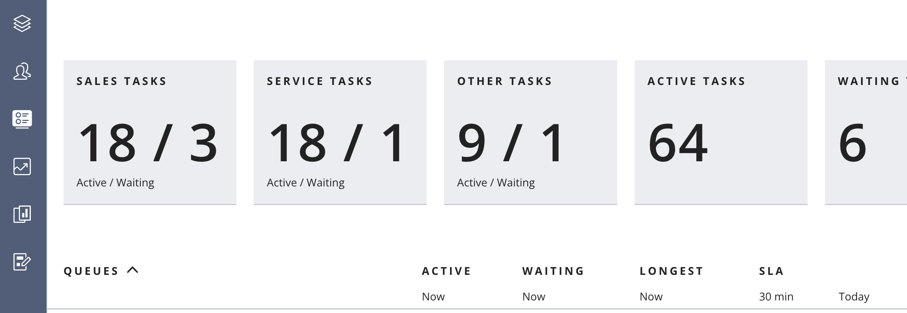
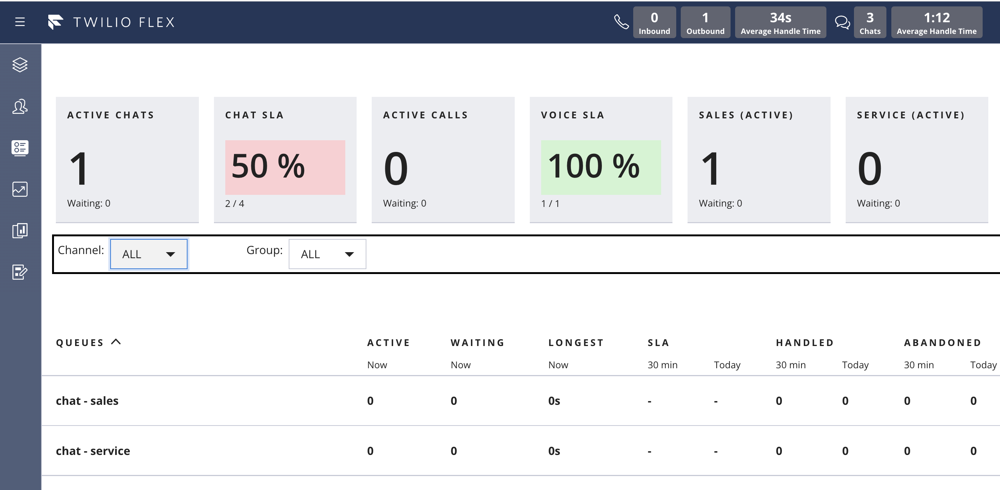
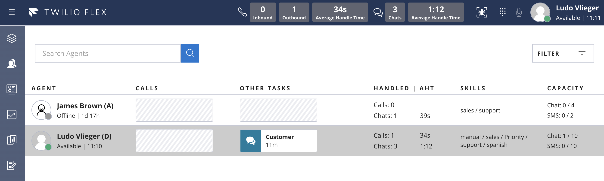
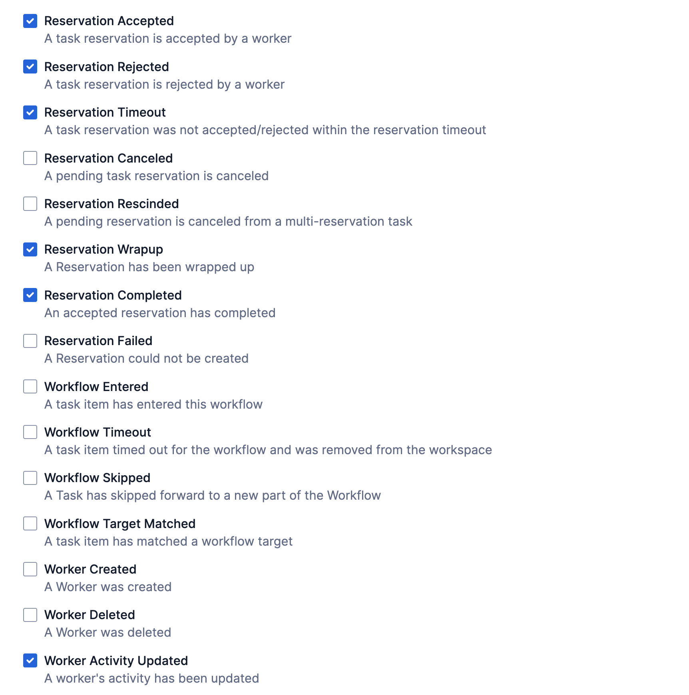

# Enhanced Flex Teams View and Queues Dashboard

Twilio Flex Plugins allow you to customize the appearance and behavior of [Twilio Flex](https://www.twilio.com/flex). If you want to learn more about the capabilities and how to use the API, check out our [Flex documentation](https://www.twilio.com/docs/flex).


## How it works

This plugin contains a set of enhancements for the Teams View and the Real-Time Queues View.

### Queue Stats Dashboard
- Filter Queues View by Agent's team_name attribute
- Manual filter to only display a "group" of queues (based on partial queue name match).
- Selectively remove a metric (waiting-tasks) based on the Queue Name
- Add Titles with Active/Waiting tasks aggregated for a set of queues (using Queue Name)  
- Add tiles with metrics aggregated by Channel

### Teams View
- Add the agent's role code (A = Agent, S = Supervisor, D = Admin) in the Teams View
- Add the Chat and SMS channel utilization (assigned / capacity, X = Unavailable)
- Display the agent's Skills

### Agent Desktop
- Show Agent's individual daily stats in top header

The Flex [Real-Time Queues View](https://www.twilio.com/docs/flex/end-user-guide/insights/real-time-queues-view) displays all queues unless you set a [filter](https://www.twilio.com/docs/flex/developer/ui/queues-view-programmability#setfilter) that hides or displays only some queues.

The [Queues Data Table](https://www.twilio.com/docs/flex/developer/ui/queues-view-programmability#modify-the-queuesdatatable) can be modifed by removing and (re)adding columns with metrics.

The Flex reference docs contain a listing of all [properties for each WorkerQueue](https://assets.flex.twilio.com/docs/releases/flex-ui/1.30.2/QueuesStats%25E2%2580%25A4QueuesDataTable.html#.QueuesStats%E2%80%A4WorkerQueue) in the QueueStats data set. 

Additional [Tiles](https://www.twilio.com/docs/flex/developer/ui/queues-view-programmability#add-or-remove-individual-data-tiles) can be added with custom metrics/KPIs.



If you aggregate the Queue stats by channel you can display the total Active Chats & Calls and calculate the SLA per channel.  Color coding can be applied to enhance the UI for Supervisors.



The Teams View can be modified by adding and removing columns in the [WorkersDataTable](https://www.twilio.com/docs/flex/developer/ui/components#add-columns-to-workersdatatable). 

This plugin leverages a Serverless function to update a Sync Doc with the worker's Chat and SMS channel capacity and assigned tasks counts from the [Worker Channel Resource](https://www.twilio.com/docs/taskrouter/api/worker-channel).  This function is invoked after the Accept Task action and again after the Complete Task action.




The JSON stored in these worker sync docs (Named: workerCapacityFor-WKxyz) has this structure:
```
{
  "smsAvailable": true,
  "chatAvailable": true,
  "smsCapacity": 2,
  "chatTasks": 0,
  "chatCapacity": 4,
  "smsTasks": 0
}
```

August 2022 Update: This plugin now also includes a custom component to display the Agent's Daily Metrics/KPIs in the top header bar.  This solution is using a Servlerless function to capture [Task Router events](https://www.twilio.com/docs/taskrouter/api/event/reference) and update a [Sync Doc](https://media.twiliocdn.com/sdk/js/sync/releases/0.9.2/docs/Client.html#document__anchor) (1 Sync Doc per worker).  The application Redux store subscribes to [Sync Doc "updated" events](https://media.twiliocdn.com/sdk/js/sync/releases/0.9.2/docs/Document.html#event:updated) and displays the current data to the Agent.

The displayed metrics are intra-day only and will reset to 0 when the agent logs in the next day.

The JSON stored in each Sync Doc (workerStatsFor-WKxyz) has this structure:
```
{
  "callStats": {
    "answered": 2,
    "totalHandlingTime": 378,
    "outbound": 1,
    "missed": 0,
    "rejected": 0
  },
  "chatStats": {
    "totalHandlingTime": 45,
    "missed": 0,
    "rejected": 0,
    "handled": 1
  },
  "loginTimestamp": 1662644380412
}
```


# Configuration

## Requirements

To deploy this plugin, you will need:

- An active Twilio account with Flex provisioned. Refer to the [Flex Quickstart](https://www.twilio.com/docs/flex/quickstart/flex-basics#sign-up-for-or-sign-in-to-twilio-and-create-a-new-flex-project%22) to create one.
- npm version 5.0.0 or later installed (type `npm -v` in your terminal to check)
- Node.js version 12 or later installed (type `node -v` in your terminal to check). We recommend the _even_ versions of Node.
- [Twilio CLI](https://www.twilio.com/docs/twilio-cli/quickstart#install-twilio-cli) along with the [Flex CLI Plugin](https://www.twilio.com/docs/twilio-cli/plugins#available-plugins) and the [Serverless Plugin](https://www.twilio.com/docs/twilio-cli/plugins#available-plugins). Run the following commands to install them:

```
# Install the Twilio CLI
npm install twilio-cli -g
# Install the Serverless and Flex as Plugins
twilio plugins:install @twilio-labs/plugin-serverless
twilio plugins:install @twilio-labs/plugin-flex
```

## Setup

Install the dependencies by running `npm install`:

```bash
cd plugin-dashboards
npm install
cd ../dashboard-service
npm install
```
From the root directory, rename `public/appConfig.example.js` to `public/appConfig.js`.

```bash
mv public/appConfig.example.js public/appConfig.js
```

## Serverless Functions


### Deployment

Create the Serverless config file by copying `.env.example` to `.env`.

```bash
cd dashboard-service
cp .env.example .env
```
Edit `.env` and set the `TWILIO_WORKSPACE_SID` variable to your Twilio TaskRouter Workspace Sid. 
Set the `TWILIO_SYNC_SERVICE_SID` variable to your default Sync Service Sid.

Next, deploy the Serverless functions:

```bash
cd dashboard-service
twilio serverless:deploy
```
After successfully deploying your function, you should see at least the following:
```bash
✔ Serverless project successfully deployed

Deployment Details
Domain: dashboard-service-xxxx-dev.twil.io

Functions:
  [protected] https://dashboard-service-xxxx-dev.twil.io/taskrouter-event-handler
   https://dashboard-service-xxxx-dev.twil.io/update-worker-capacity
```

Your function will now be present in the Twilio Functions Console and be part of the "dashboard-service" service. Copy the base URL from the function.

### TaskRouter Events Callback URL

Configure the Task Router Events callback URL as follows:


Select the following events:




## Flex Plugin

### Development

Create the plugin config file by copying `.env.example` to `.env`.

```bash
cd plugin-dashboards
cp .env.example .env
```

Edit `.env` and set the `FLEX_APP_FUNCTIONS_BASE` variable to your Twilio Functions base URL (like https://dashboard-service-xxxx-dev.twil.io). 

To run the plugin locally, you can use the Twilio Flex CLI plugin. Using your command line, run the following from the root directory of the plugin.

```bash
cd plugin-dashboards
twilio flex:plugins:start
```

This will automatically start up the webpack dev server and open the browser for you. Your app will run on `http://localhost:3000`.

When you make changes to your code, the browser window will be automatically refreshed.


### Deploy your Flex Plugin

Once you are happy with your Flex plugin, you have to deploy then release it on your Flex application.

Run the following command to start the deployment:

```bash
twilio flex:plugins:deploy --major --changelog "Releasing Dashboards plugin" --description "Dashboards plugin"
```

After running the suggested next step, navigate to the [Plugins Dashboard](https://flex.twilio.com/admin/) to review your recently deployed plugin and confirm that it’s enabled for your contact center.

**Note:** Common packages like `React`, `ReactDOM`, `Redux` and `ReactRedux` are not bundled with the build because they are treated as external dependencies so the plugin will depend on Flex to provide them globally.

You are all set to test this plugin on your Flex application!

## License

[MIT](http://www.opensource.org/licenses/mit-license.html)

## Disclaimer

No warranty expressed or implied. Software is as is.


